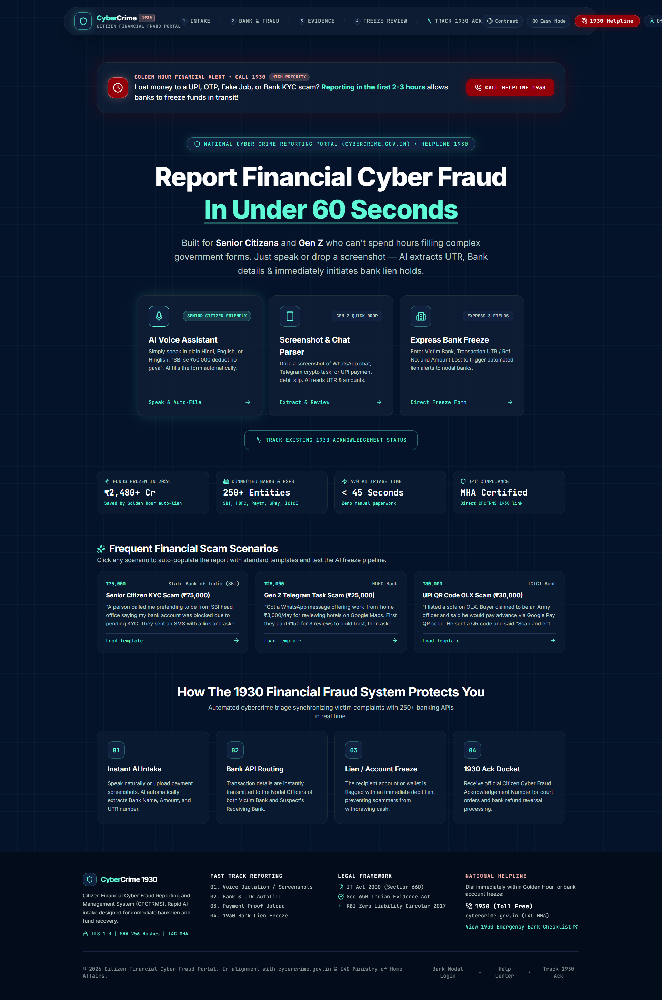
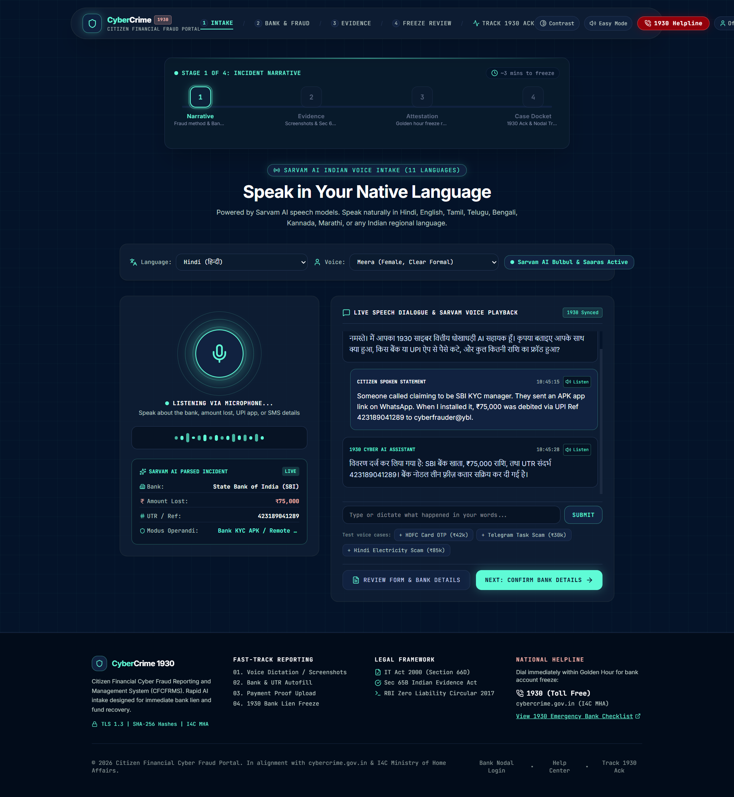
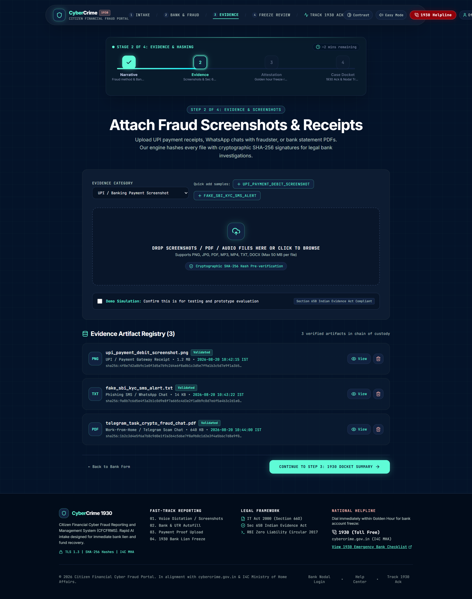
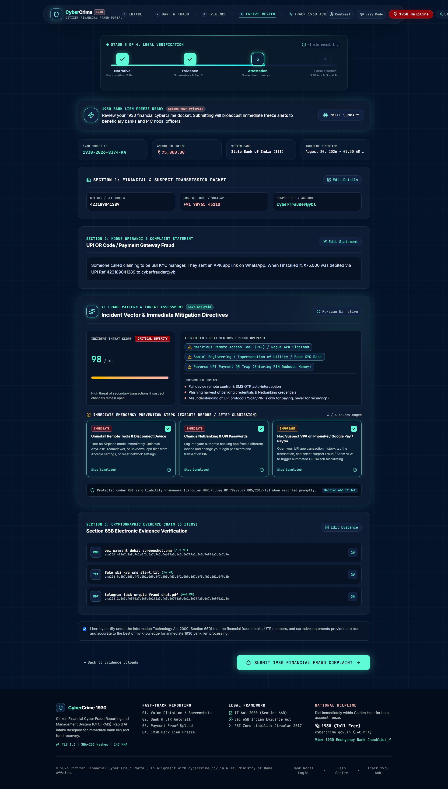
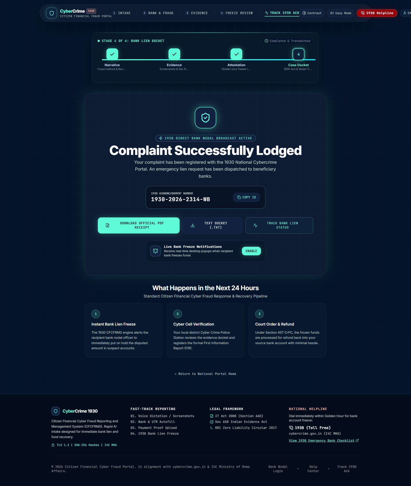
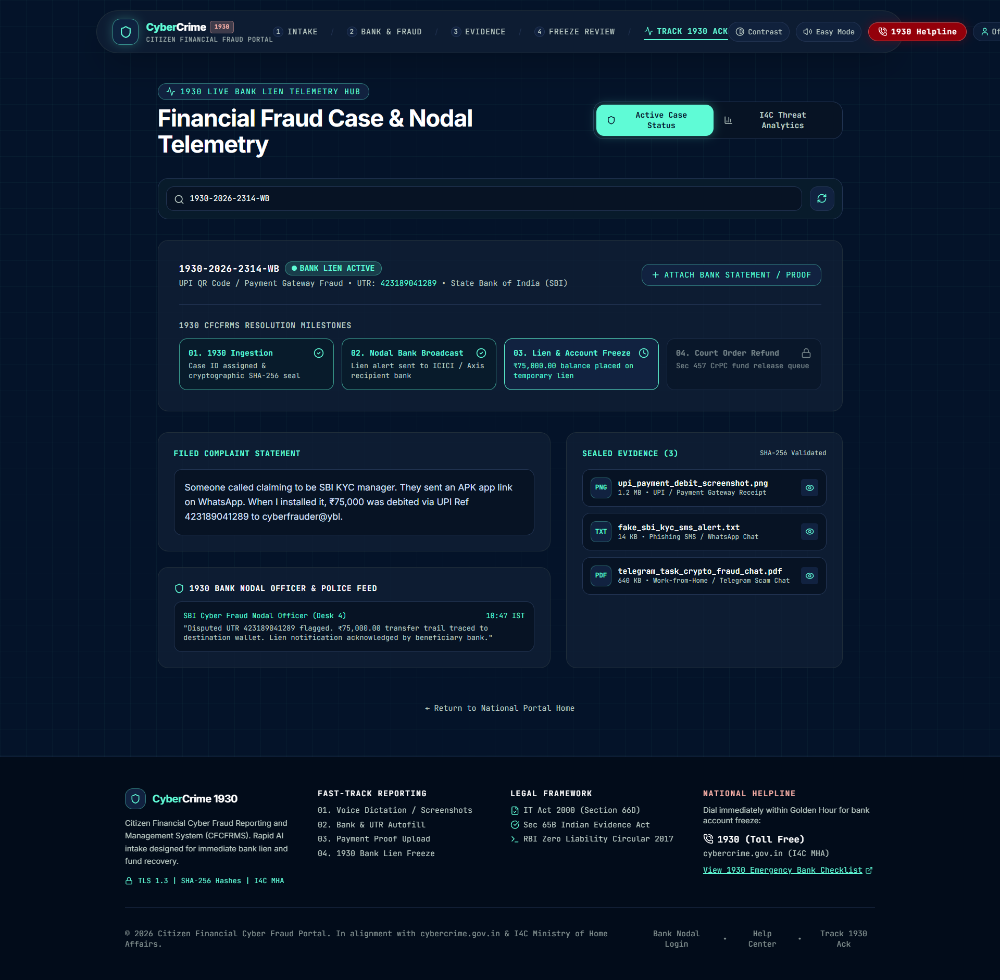
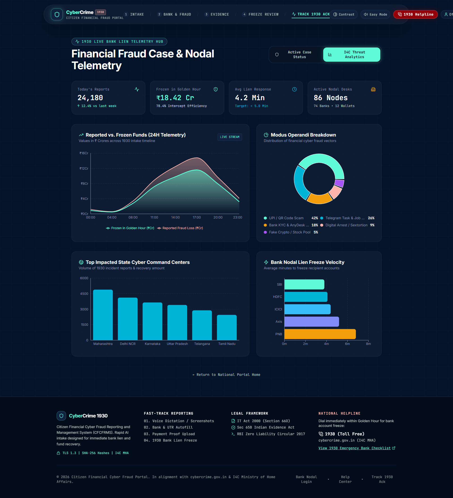
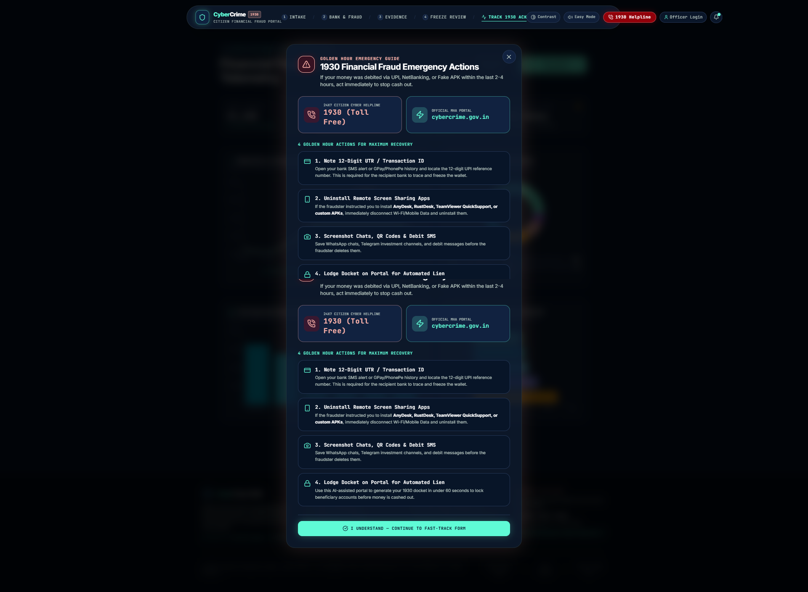
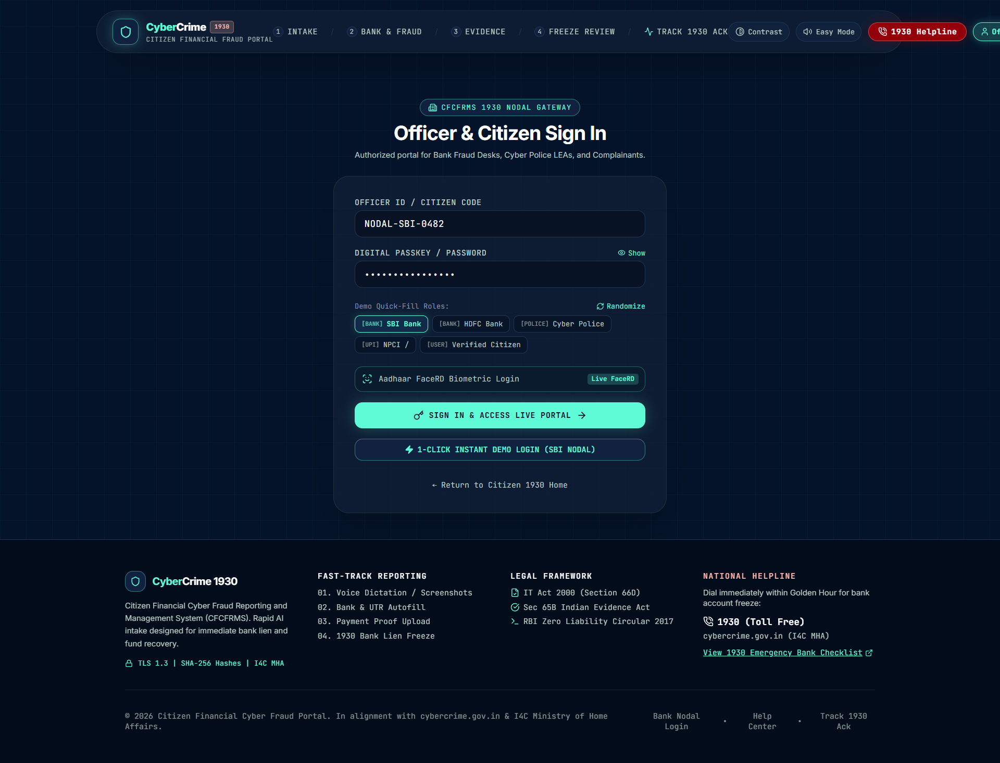

# CyberGuard 1930 — Citizen Financial Cyber Fraud Reporting Portal

An AI-powered rapid financial fraud reporting system inspired by India's National Cybercrime Reporting Portal (Helpline 1930). Built for both Gen Z and senior citizens, it lets victims report cybercrime in under 60 seconds using voice dictation in 11 Indian languages, with automatic entity extraction, evidence handling, and bank lien simulation.



## Features

### Voice-First Reporting (11 Indian Languages)
- **Speech-to-Text** powered by Sarvam AI Saaras model — speak naturally in Hindi, Tamil, Telugu, Bengali, Kannada, Marathi, Punjabi, Gujarati, Odia, Malayalam, or English
- **Text-to-Speech** playback using Sarvam AI Bulbul model with 6 voice options (Meera, Pavithra, Maitreyi, Arvind, Amol, Amartya)
- **Live entity extraction** — as the victim speaks, the system parses bank names, amounts, UTR numbers, suspect phone numbers, UPI IDs, and fraud type in real-time
- Falls back to browser Web Speech API when Sarvam API is unavailable

### Multi-Step Complaint Flow
1. **Home** — landing page with emergency helpline numbers and quick-start fraud templates
2. **Input Selection** — choose between voice dictation or text-based narrative
3. **Narrative** — structured form with auto-populated bank details from voice input
4. **Evidence Upload** — attach screenshots, receipts, and phishing SMS with hash validation
5. **Summary Review** — AI risk assessment with threat score and prevention tips
6. **Confirmation** — case ID generation, acknowledgement number, and PDF export
7. **Case Tracker** — officer dashboard with analytics, evidence vault, and case timeline

### AI Risk Assessment Engine
- Detects 6 fraud modus operandi categories: Remote Access/APK, KYC phishing, Telegram task scams, Digital arrest extortion, UPI QR traps, and SIM swap fraud
- Calculates a threat score (65–98) with actionable prevention tips
- References RBI Zero Liability Framework and DPDP compliance guidelines
- Identifies "Golden Hour" eligibility (within 2–4 hours of fraud)

### Accessibility
- **Senior Mode** — larger fonts and relaxed spacing
- **High Contrast** — accessible color scheme toggle
- **Session Auto-Recovery** — draft auto-saved to sessionStorage with restore banner

### Officer & Citizen Authentication
- Role-based demo presets (SBI Nodal, HDFC Vigilance, Cyber Police LEA, NPCI Gateway, Citizen)
- Biometric FaceRD simulator with camera access (falls back to simulation)
- All authentication is client-side demo only — no real credentials are validated

## Tech Stack

| Layer | Technology |
|-------|----------|
| Frontend | React 19, TypeScript, Tailwind CSS v4, Framer Motion |
| Icons | Lucide React |
| Charts | Recharts |
| PDF Export | jsPDF |
| Backend | Express.js, Node.js |
| AI/ML | Sarvam AI (TTS: Bulbul v1, STT: Saaras v1, Translation: Mayura v1) |
| Build | Vite 6, esbuild |
| License | Apache-2.0 |

## Architecture

```
┌──────────────────────────────────────────────────┐
│                React Frontend (Vite)                │
│  ┌──────────┐  ┌──────────┐  ┌────────────────┐   │
│  │ Home     │→ │ Voice/   │→ │ Narrative +    │   │
│  │ Screen   │  │ Text     │  │ Bank Details   │   │
│  └──────────┘  └──────────┘  └───────┬────────┘   │
│                                     │              │
│  ┌──────────┐  ┌──────────┐        │              │
│  │ Confirm  │← │ Summary  │←───────┘              │
│  │ + PDF    │  │ + Risk   │  ┌────────────────┐   │
│  └──────────┘  └──────────┘  │ Evidence Upload │   │
│                              └────────────────┘   │
└──────────────────┬─────────────────────────────────┘
                   │ fetch /api/*
┌──────────────────┴─────────────────────────────────┐
│              Express Backend (server.ts)             │
│  ┌──────────┐  ┌──────────┐  ┌────────────────┐   │
│  │ /health   │  │ /sarvam/ │  │ /sarvam/parse  │   │
│  │           │  │ tts,stt  │  │ -incident      │   │
│  └──────────┘  └────┬─────┘  └────────────────┘   │
│                     │                                │
│              Rate limiter (60 req/min/IP)           │
└─────────────────────┬──────────────────────────────┘
                      │ HTTPS
              ┌───────┴────────┐
              │  Sarvam AI API │
              │  api.sarvam.ai │
              └────────────────┘
```

## Quick Start

### Prerequisites
- Node.js 18+ and npm (or bun)
- A Sarvam AI API key (get one from [sarvam.ai](https://sarvam.ai))

### Installation

```bash
git clone https://github.com/Sandeep-Hipparagi/CyberCrime.git
cd CyberCrime
npm install
```

### Configuration

Copy the environment example and add your Sarvam API key:

```bash
cp .env.example .env
```

Edit `.env` and set:
```env
SARVAM_API_KEY="your-sarvam-api-key-here"
SARVAM_BASE_URL="https://api.sarvam.ai"
```

> The server will refuse to start without a valid `SARVAM_API_KEY`.

### Run Development Server

```bash
npm run dev
```

This starts the Express server on port 3000 with Vite HMR.

### Build for Production

```bash
npm run build
npm start
```

### Type Checking

```bash
npm run lint
```

## API Endpoints

| Method | Path | Description |
|--------|------|-------------|
| GET | `/api/health` | Server liveness check |
| GET | `/api/sarvam/info` | Supported languages and voices |
| POST | `/api/sarvam/tts` | Text-to-Speech (returns base64 audio) |
| POST | `/api/sarvam/stt` | Speech-to-Text (accepts base64 audio) |
| POST | `/api/sarvam/translate` | Translate between Indian languages |
| POST | `/api/sarvam/parse-incident` | Extract fraud entities from text (bank, amount, UTR, phone, fraud type) |

### Example: Parse Incident

```bash
curl -X POST http://localhost:3000/api/sarvam/parse-incident \
  -H "Content-Type: application/json" \
  -d '{"text": "Someone called from SBI KYC and asked me to install AnyDesk. ₹75000 was debited via UPI ref 423189041289"}'
```

Response:
```json
{
  "success": true,
  "entities": {
    "bank": "State Bank of India (SBI)",
    "amount": "₹75,000",
    "utr": "423189041289",
    "suspectPhone": "",
    "fraudType": "Bank KYC APK / Remote Access Scam",
    "suspectUpiOrAccount": ""
  }
}
```

## Project Structure

```
.
├── server.ts                          # Express backend (Sarvam API proxy + rate limiting)
├── src/
│   ├── App.tsx                        # Root component, screen routing, session state
│   ├── main.tsx                       # React entry point
│   ├── types.ts                       # TypeScript domain models
│   ├── index.css                      # Global styles + Tailwind
│   ├── data/
│   │   └── mockData.ts                # Default complaint, fraud categories, Indian banks
│   ├── utils/
│   │   ├── sarvamService.ts           # Sarvam AI client (TTS, STT, entity parsing)
│   │   ├── aiRiskAssessment.ts         # Fraud risk scoring engine
│   │   └── notificationService.ts     # Browser notification service
│   └── components/
│       ├── TopNavbar.tsx              # Navigation header with accessibility toggles
│       ├── Footer.tsx                 # Footer with helpline links
│       ├── common/
│       │   ├── ProgressStepper.tsx    # Multi-step flow indicator
│       │   └── AIRiskAssessmentCard.tsx
│       ├── modals/
│       │   ├── EvidencePreviewModal.tsx
│       │   └── ImmediateHelpModal.tsx
│       └── screens/
│           ├── HomeScreen.tsx         # Landing page
│           ├── AuthScreen.tsx         # Officer/citizen login (demo)
│           ├── SelectInputScreen.tsx  # Voice vs text choice
│           ├── VoiceInputScreen.tsx   # Voice dictation with live parsing
│           ├── NarrativeScreen.tsx    # Structured complaint form
│           ├── EvidenceScreen.tsx     # Evidence upload
│           ├── SummaryScreen.tsx      # Review + risk assessment
│           ├── ConfirmationScreen.tsx  # Case ID + PDF export
│           └── CaseTrackerScreen.tsx   # Officer analytics dashboard
├── screenshots/                        # App screenshots
├── vite.config.ts
├── tsconfig.json
├── package.json
└── .env.example
```

## Security Notes

- **API Key**: The Sarvam API key is loaded from the `SARVAM_API_KEY` environment variable. The server exits immediately if it is missing. Never hardcode API keys in source code.
- **Rate Limiting**: The backend enforces 60 requests per minute per IP to prevent abuse.
- **Input Validation**: The `parse-incident` endpoint limits input to 10,000 characters to prevent ReDoS attacks.
- **No Real Authentication**: All login flows are client-side demo only. This is a prototype — do not deploy without implementing real authentication.
- **No Fabricated Data**: When entity parsing fails, the system returns empty strings rather than injecting fabricated financial data into complaints.

## Fraud Detection Categories

| Category | Keywords Detected |
|----------|------------------|
| Remote Access / APK Scam | anydesk, teamviewer, rustdesk, apk, screen share |
| Bank KYC / Phishing | kyc, electricity, sim block, pan card, account suspended |
| Telegram Task / Pig Butchering | telegram, part-time, youtube like, crypto, investment |
| Digital Arrest / Impersonation | police, cbi, customs, fedex, parcel, digital arrest |
| UPI QR Code Scam | qr, scan to receive, olx, marketplace |
| SIM Swap / 5G Fraud | sim, esim, 5g upgrade |

## Accessibility Features

- **Senior Citizen Mode**: Enlarged text, relaxed line height
- **High Contrast Mode**: WCAG-aware color scheme
- **Voice-First Design**: Reduces typing burden for elderly users
- **11 Indian Languages**: Native script support for TTS and STT
- **Session Recovery**: Auto-saves draft to sessionStorage

## Screenshots

| Screen | Preview |
|--------|---------|
| Home — Report Financial Cyber Fraud |  |
| Incident Narrative |  |
| Evidence & Hashing |  |
| Legal Verification |  |
| Complaint Successfully Lodged |  |
| Case Tracker — Nodal Telemetry |  |
| Case Tracker — Detail View |  |
| Emergency Help Modal |  |
| Officer & Citizen Sign In |  |

> A sample complaint docket PDF is available in the [v1.0.0-screenshots release](https://github.com/Sandeep-Hipparagi/CyberCrime/releases/tag/v1.0.0-screenshots).

## License

Apache-2.0 — See [LICENSE](./LICENSE) file for details.

## Acknowledgements

- [Sarvam AI](https://sarvam.ai) for Indian language voice models (Bulbul TTS, Saaras STT, Mayura Translation)
- [React](https://react.dev), [Vite](https://vitejs.dev), [Tailwind CSS](https://tailwindcss.com)
- [Framer Motion](https://www.framer.com/motion/) for animations
- [Recharts](https://recharts.org) for data visualization
- [Lucide](https://lucide.dev) for icons
- National Cybercrime Reporting Portal (1930) for inspiration
